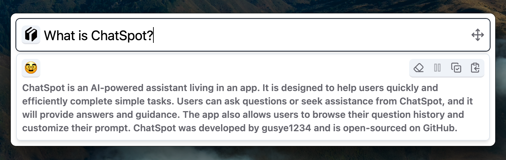
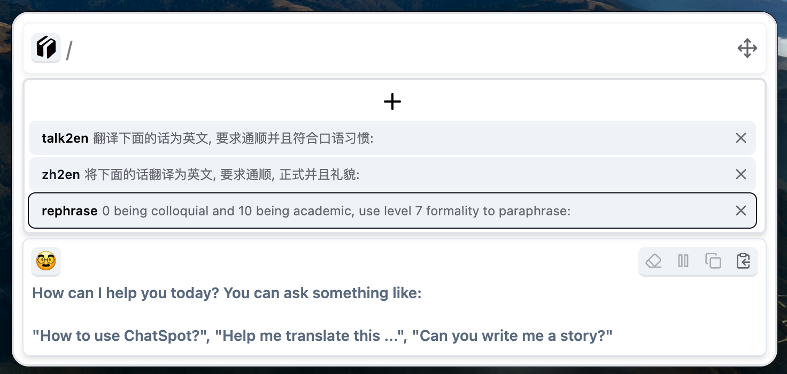

<div align="center">
  <h1>ChatSpot🥸</h1>
  <p><strong>Spotlight app for ChatGPT</strong></p>
    <p>
    <a href="https://github.com/gusye1234/chat-spot">
      
    </a>
    <a href="https://github.com/gusye1234/chat-spot">
      
    </a>
  </p>
</div>


ChatSpot is an AI-powered, S potlight assistant designed to help users complete tasks quickly and efficiently. Anytime or angwhere, press `command/ctrl + alt + k`, ChatSpot is always ready to assist. 

By default, anything said by ChatSpot will be automatically copied. So all you need is:

1. Toggle ChatSpot with gobal shortcut  `command/ctrl + alt + k`
2. Ask question and wait the streaming output finished
3. Untoggle ChatSpot with gobal shortcut  `command/ctrl + alt + k`, and the focus will be back to your previsous working place, where you can paste the response from ChatGPT

ChatSpot also supports custom prompts. You can use "/" to invoke a window customized with your prompt.



## Get Started

> **Using ChatSpot requires your own OpenAI key to connect to ChatGPT.**

Download the app

| Platform | Tested Supports    | Download |
| -------- | ------------------ | -------- |
| MacOS    | Support 13.5.2+    |          |
| Windows  | Haven't tested yet | /        |
| Linux    | Haven't tested yet | /        |


## Development

Clone this repo and run the following commands:

```shell
pnpm install
pnpm dev
```

To package the App in your platform (MacOS, Windows, Linux...), run:

```shell
pnpm package
```


## Credits

* Thanks to [Electron React Boilerplate](https://github.com/electron-react-boilerplate/electron-react-boilerplate) , I saved a lot of time for the inital setup.
