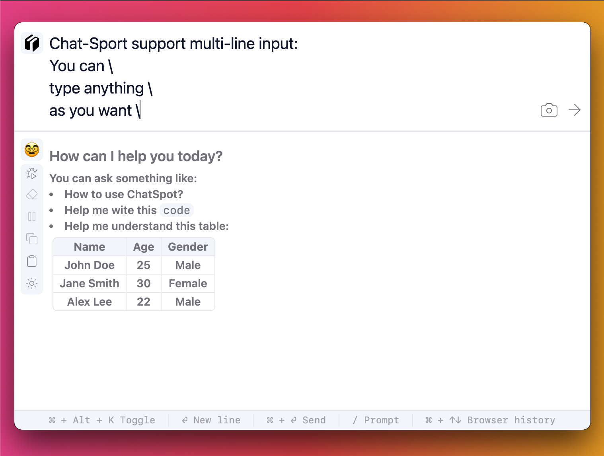
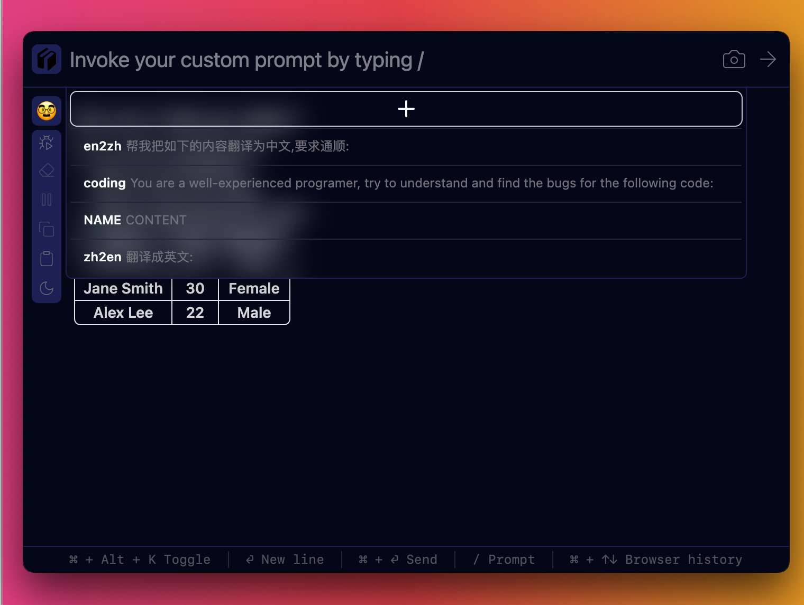

<div align="center">
  <h1>ChatSpot🥸</h1>
  <p><strong>Spotlight app for ChatGPT</strong></p>
    <p>
    <a href="https://github.com/gusye1234/chat-spot/releases/tag/v0.0.2">
      
    </a>
          <a href="https://github.com/gusye1234/chat-spot/actions?query=workflow%3APublish">
      
    </a>
    <a href="https://github.com/gusye1234/chat-spot?tab=readme-ov-file#get-started">
      
    </a>
    <a href="https://github.com/gusye1234/chat-spot?tab=readme-ov-file#get-started">
      
    </a>
    <a href="https://github.com/gusye1234/chat-spot?tab=readme-ov-file#get-started">
      
    </a>
  </p>
</div>


🥸 ChatSpot is an AI-powered, Spotlight assistant designed to help users complete tasks quickly and efficiently. Anytime or anywhere, press `command/ctrl + alt + k` and ChatSpot is always ready to assist. 


Light             | Dark 
:-------------------------:|:-------------------------:
  |  

🔥 It supports multi-lines input, and support as many MarkDown types as possible:
Multi-line Input             | Markdown Output 
:-------------------------:|:-------------------------:
  |  

📒 It supports custom prompt saving, all you need to type '/' and your own prompt sheet will show up:



Anything said by ChatSpot can be automatically copied (turn autocopy on). So all you need is:

1. Toggle ChatSpot with gobal shortcut  `command/ctrl + alt + k`
2. Ask question and wait the streaming output finished
3. Untoggle ChatSpot with gobal shortcut  `command/ctrl + alt + k`, and the focus will be back to your previsous working place, where you can paste the response from ChatGPT


Also, ChatSpot supports the latest GPT-4 vision, you can snip anywhere of your screen and ask about it🤯:

<p align="center">
  
</p>

## Get Started

> **Using ChatSpot requires your own OpenAI key to connect to ChatGPT.**

Download the app

| Platform | Tested Supports | Download                                                     |
| -------- | --------------- | ------------------------------------------------------------ |
| MacOS    | 13.5.2+         | [Release](https://github.com/gusye1234/chat-spot/releases/download/v0.0.4/ChatSpot-0.0.4.dmg) |
| Windows  | Windows 10      | [Release](https://github.com/gusye1234/chat-spot/releases/download/v0.0.4/ChatSpot-Setup-0.0.4.exe) |
| Linux    | Ubuntu 22.04    | [Release](https://github.com/gusye1234/chat-spot/releases/download/v0.0.4/ChatSpot-0.0.4.AppImage) |


## Development

Clone this repo and run the following commands:

```shell
npm install
npm run dev
```

To package the App in your platform (MacOS, Windows, Linux...), run:

```shell
npm run package
```


## Credits

* Thanks to [Electron React Boilerplate](https://github.com/electron-react-boilerplate/electron-react-boilerplate) , I saved a lot of time for the inital setup.
* Thanks [electron-screenshots](https://github.com/nashaofu/screenshots) (readme in Chinese), it has supported the screenshot function of ChatSpot.
